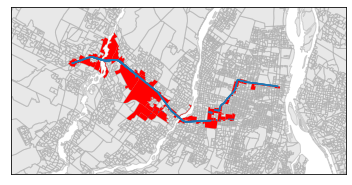
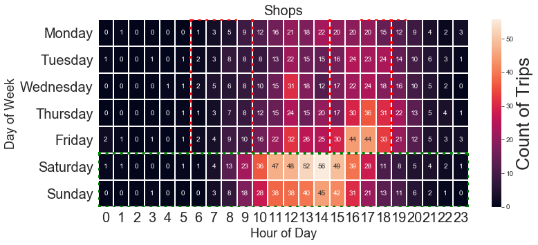
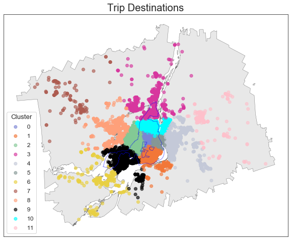
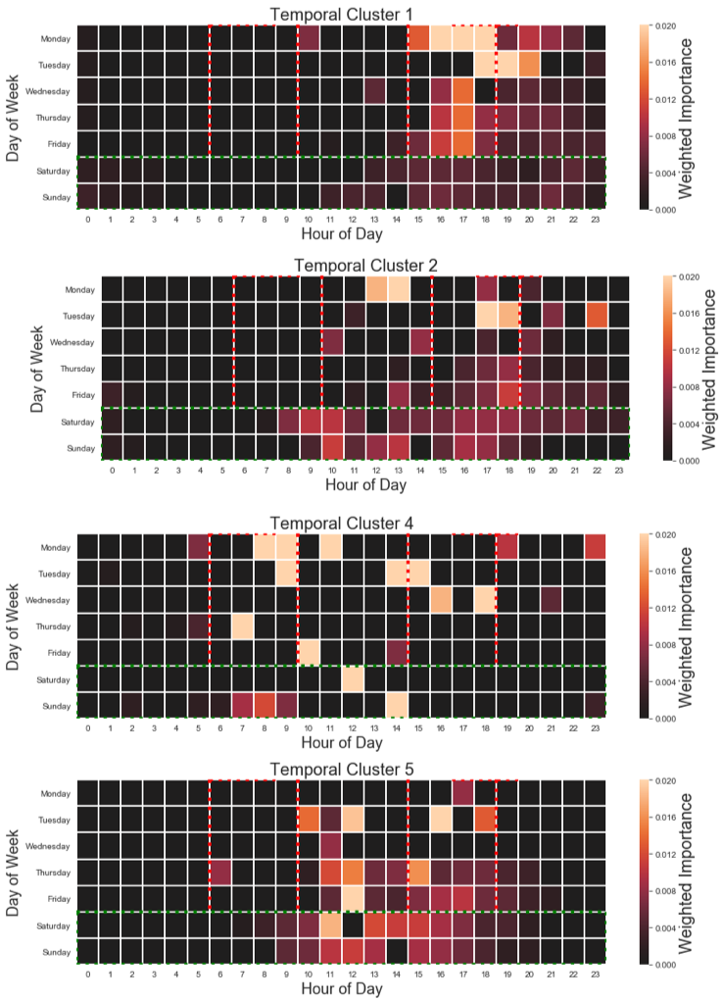

# Trip Purpose Classification project
WORK-IN-PROGRESS. See Data/, Notebooks/ or Scripts/ for more information

## To-do
- potentially: define the study area based on a buffer around MTL Trajet
- replace Euclidean with Geodetic distance
- Make the start and end clusters the same?... so they do not shift

## Example figures

